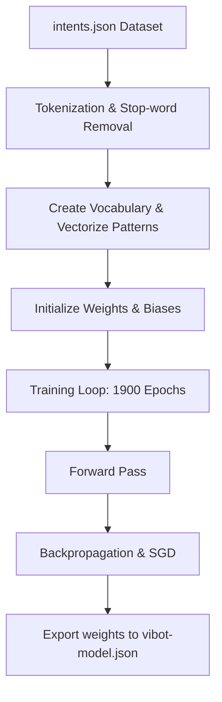
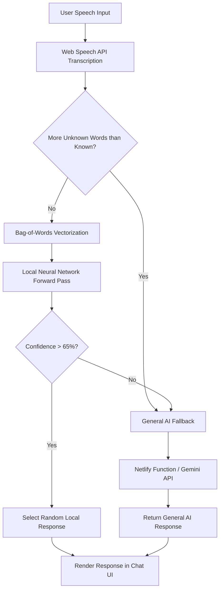

# ViBot — Voice-Enabled Chatbot

## 1. Dataset & Preprocessing
The dataset (`data/intents.json`) is structured as a collection of 15 conversational intents (e.g., greetings, goodbyes, weather, jokes, programming help). Each intent contains an array of sample user inputs (`patterns`) and corresponding bot replies (`responses`). 

**Preprocessing Pipeline:**
1. **Normalization:** Input text is converted to lowercase and all non-alphanumeric characters are stripped.
2. **Tokenization & Stop-word Removal:** The text is split into tokens. A predefined set of 26 common stop-words (e.g., *'a', 'the', 'is', 'it'*) are filtered out.
3. **Bag-of-Words (BoW):** The remaining tokens form a unified vocabulary. Each training pattern is converted into a binary BoW vector representing the presence (`1`) or absence (`0`) of vocabulary words.

## 2. Model Architecture
The chatbot utilizes a custom-built feed-forward Deep Learning Neural Network (Multi-Layer Perceptron) implemented entirely in JavaScript.

* **Input Layer:** Size matches the vocabulary length. Receives the binary BoW vector.
* **Hidden Layer:** A dense layer with 48 neurons. It utilizes the Rectified Linear Unit (ReLU) activation function (`Math.max(0, n)`) to capture non-linear relationships between words and prevent vanishing gradients.
* **Output Layer:** A dense layer with 15 neurons (matching the number of intent classes). It utilizes the Softmax activation function to output a normalized probability distribution across all possible intents.

### Training Flow

## 3. Methodology

### A. Training Phase (`scripts/train-model.js`)
The model is trained entirely from scratch using **Stochastic Gradient Descent (SGD)** and manual backpropagation. No external machine learning libraries (like TensorFlow or PyTorch) are used. 
* **Epochs:** The model trains for 1,900 epochs.
* **Learning Rate Decay:** The learning rate starts at `0.055` to quickly descend the loss gradient, and decays to `0.018` after 1,200 epochs for fine-tuning.
* **Export:** The trained weights, biases, vocabulary, and response mappings are exported into a lightweight JSON file (`model/vibot-model.json`).

### B. Client-Side Speech & Inference (`app.js`)
The client-side application handles real-time voice processing and on-device inference:
1. **Speech Recognition:** Requests microphone access and uses the browser's native `window.SpeechRecognition` API. It transcribes audio continuously as the user speaks.
2. **On-Device Inference:** When transcription finishes, the text is vectorized and passed through the neural network weights loaded from `vibot-model.json`. The forward pass is computed directly in the browser via matrix multiplication.

### C. Fallback System (`netlify/functions/chat.js`)
To handle out-of-domain queries, a heuristic checks if the user's input contains more unknown words (out-of-vocabulary) than known words. If so, or if the neural network's confidence is below the 65% threshold, the query is routed to a serverless Netlify function. The function queries the **Google Gemini 3.6-flash LLM** with the last 8 messages of conversation history to generate a context-aware response.

### Application Workflow

## 4. Results
* **Training:** The neural intent classifier successfully converges, achieving high accuracy on the training dataset.
* **Production:** The system successfully listens to user audio and transcribes it in real-time. It accurately classifies common intents locally with **zero server latency**, falling back to the cloud LLM seamlessly only when presented with general knowledge questions.
